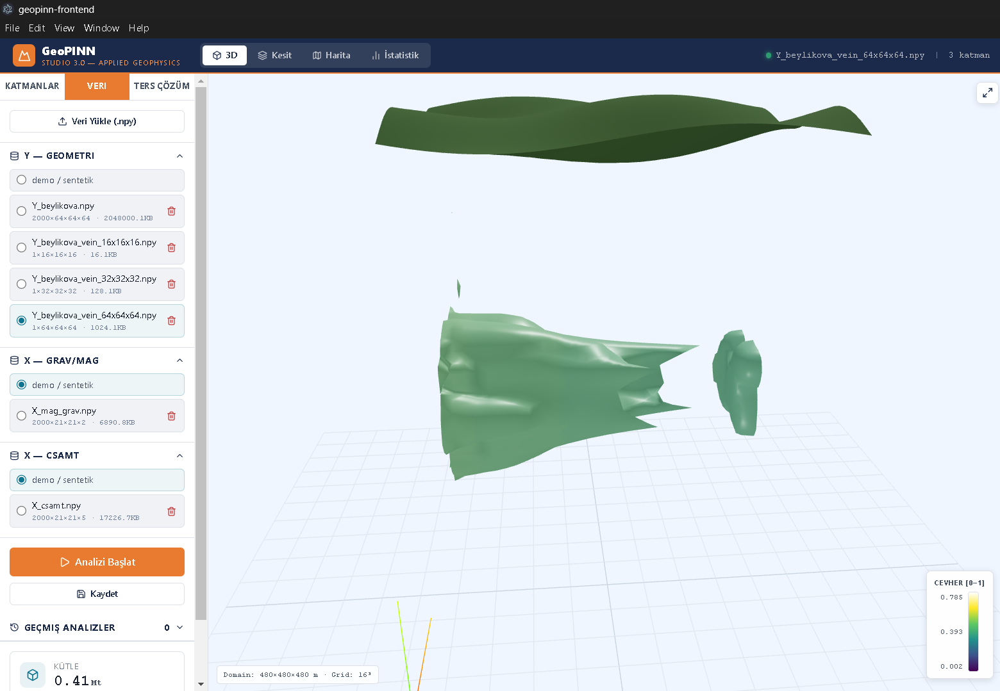
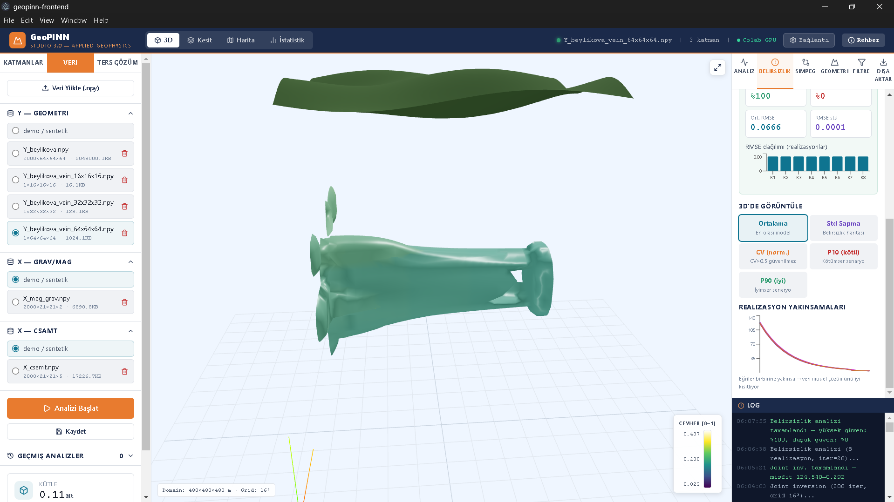
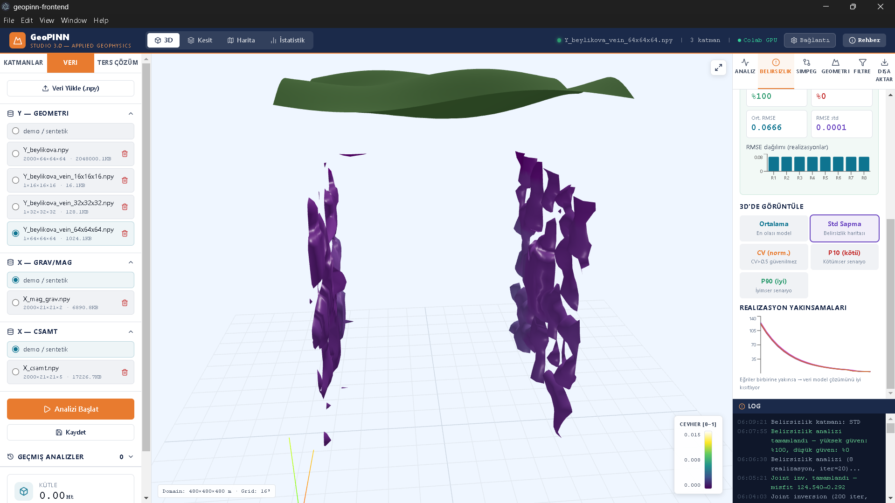
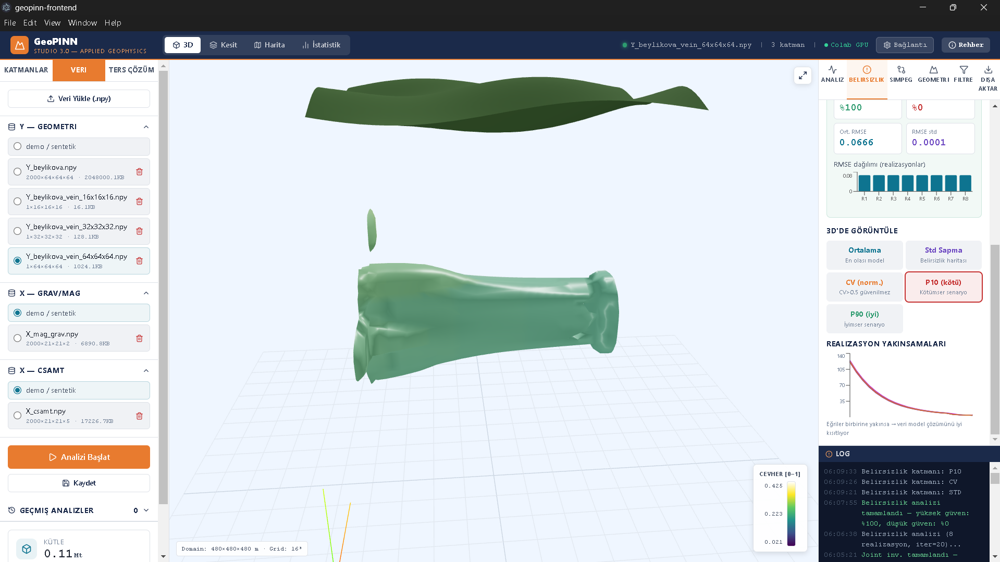
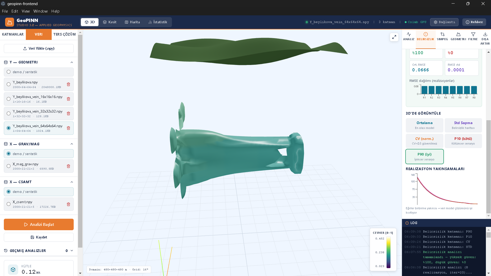
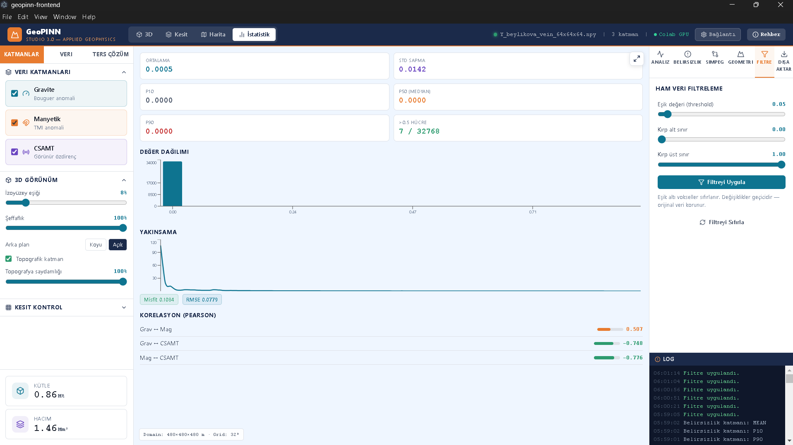
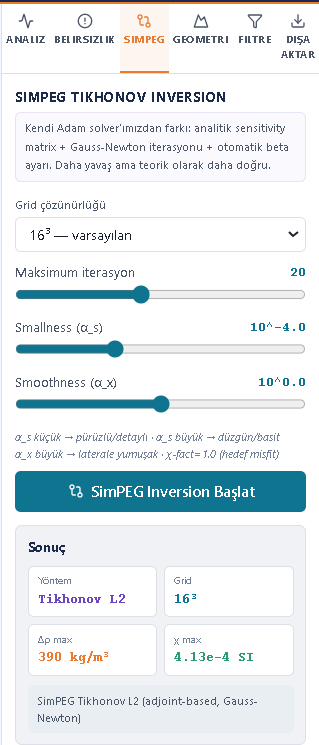

# GeoPINN Studio 3.0

<div align="center">

**Applied Geophysics Desktop Application**  
*Gravity · Magnetics · CSAMT — 3D Forward Modelling & Joint Inversion*

[](LICENSE)
[](https://python.org)
[](https://electronjs.org)
[](https://simpeg.xyz)

</div>

---

## Overview / Genel Bakış

GeoPINN Studio is a cross-platform desktop application for 3D geophysical forward modelling and joint inversion. It integrates gravity, magnetic, and CSAMT methods with geological uncertainty quantification, targeting mineral exploration workflows.

GeoPINN Studio, 3B jeofiziksel forward modelleme ve ortak ters çözüm için çapraz platform masaüstü uygulamasıdır. Gravite, manyetik ve CSAMT yöntemlerini jeolojik belirsizlik ölçümüyle entegre eder.

---

## Screenshots / Ekran Görüntüleri

### 3D Joint Inversion — Beylikova REE Vein Geometry

*16³ grid · 200 iterations · 3 methods (Gravity + Magnetics + CSAMT) · Misfit 124.54 → 0.29*

### Uncertainty Analysis — Mean Model

*8 realizations · 15% noise · 100% high confidence · RMSE 0.0666*

### Uncertainty Analysis — Standard Deviation

*Purple regions: high variability between realizations (unreliable zones)*

### Uncertainty Analysis — P10 (Pessimistic) & P90 (Optimistic)
| P10 — Minimum Guaranteed | P90 — Optimistic |
|:---:|:---:|
|  |  |

### Statistics & Cross-Method Correlation

*Grav↔CSAMT = −0.748 · Mag↔CSAMT = −0.776 — classic REE-sulphide signature*

### SimPEG Tikhonov L2 Inversion

*Adjoint-based · Gauss-Newton · Δρ = 390 kg/m³ · χ = 4.13×10⁻⁴ SI*

---

## Key Results — Beylikova REE Analogue

| Parameter | Value |
|-----------|-------|
| Inversion methods | Adam gradient (3-method joint) + SimPEG Tikhonov L2 |
| Grid | 16³ voxels · 30 m/voxel · 480×480×480 m domain |
| Final misfit | 124.54 → **0.29** (99.8% reduction) |
| RMSE | **0.0666** |
| Uncertainty confidence | **100% high**, 0% low (8 realizations) |
| RMSE std across realizations | **0.0001** |
| Guaranteed ore mass (P10) | **~0.11 Mt** |
| Optimistic ore mass (P90) | **~0.12 Mt** |
| Grav ↔ CSAMT correlation | **−0.748** |
| Mag ↔ CSAMT correlation | **−0.776** |

---

## Features / Özellikler

**Geophysical Methods**
- 3D Gravity Forward — Prism Nagy formula (mGal)
- 3D Magnetics Forward — Bhattacharyya TMI (nT)
- CSAMT/MT Forward — 1D Ward & Hohmann apparent resistivity
- Joint Inversion — Adam optimizer, reg_lambda = 0.001 (tuned via grid search)
- SimPEG Tikhonov L2 — Adjoint-based, Gauss-Newton, automatic beta scheduling

**Uncertainty Quantification**
- Multi-realization inversion (3–15 realizations)
- Statistical layers: Mean · Std Dev · CV (Coefficient of Variation) · P10 · P90
- RMSE distribution chart across realizations

**Visualization**
- Interactive 3D isosurface with viridis colormap (vertex-colored)
- 2D cross-section viewer (X/Y/Z axes) with zoom, pan, pixel tooltip
- REE anomaly map (max intensity projection, Z-axis)
- Convergence charts, Pearson cross-correlation matrix

**Data & Export**
- `.npy` dataset upload (Y geometry, X gravity/mag, X CSAMT)
- Synthetic geometry generator: vein · pipe · lens · stratabound
- Export: PNG anomaly map · CSV point cloud · TXT log
- Analysis history with save/load (SQLite-backed JSON)

**Backend Options**
- Local: PyInstaller exe or Python uvicorn
- Cloud GPU: Google Colab via ngrok (runtime-configurable, no rebuild)

---

## Installation / Kurulum

### Users — Download Binary

Get the latest installer from [Releases](../../releases):

| Platform | File |
|----------|------|
| Windows | `GeoPINN.Studio.Setup.3.x.x.exe` |
| macOS | `GeoPINN.Studio-3.x.x.dmg` |
| Linux | `GeoPINN.Studio-3.x.x.AppImage` |

### Developers — Run from Source

```bash
# Requirements: Node.js 20+, Python 3.11+

git clone https://github.com/bilaltlc/geopinn-studio.git
cd geopinn-studio

# Frontend
cd geopinn-frontend && npm install

# Backend
cd ../geopinn-backend
pip install fastapi uvicorn numpy scipy torch simpeg discretize harmonica python-multipart

# Terminal 1 — Frontend dev server
cd geopinn-frontend && npm run dev

# Terminal 2 — Backend
cd geopinn-backend
python -m uvicorn server:app --reload --host 127.0.0.1 --port 8000
```

### Build Installer

```bash
cd geopinn-frontend
npm run dist
# → dist-electron/GeoPINN Studio Setup 3.x.x.exe
```

---

## Colab GPU Mode / Colab GPU Modu

Run GPU-accelerated inversion without a local GPU:

1. Open `geopinn_colab_backend.ipynb` in [Google Colab](https://colab.research.google.com)
2. Select **T4 GPU** runtime → Run all cells
3. Copy the ngrok URL printed in the output
4. In the app: click **"Bağlantı"** in the top toolbar
5. Select **Colab GPU** mode, paste the URL → **Save & Connect**

The URL is saved locally — update it via the same dialog whenever Colab generates a new session. No rebuild required.

> **Idle protection:** The notebook auto-shuts down after 30 minutes of inactivity to conserve GPU quota.

---

## Architecture / Mimari

```
geopinn-studio/
├── geopinn-frontend/
│   ├── src/App.jsx            # React UI (Three.js, Recharts)
│   ├── main.cjs               # Electron main process
│   ├── preload.cjs            # IPC context bridge
│   └── scripts/build-backend.cjs
│
├── geopinn-backend/
│   ├── server.py              # FastAPI + all inversion logic
│   └── engines/
│       ├── gravity_prism.py   # PyTorch gravity forward
│       ├── magnetic_prism.py  # PyTorch magnetics forward
│       ├── csamt_1d.py        # PyTorch CSAMT 1D
│       ├── fvm_core.py        # FVM Poisson solver
│       ├── petrophysics.py
│       └── harmonica_validation.py
│
└── geopinn_colab_backend.ipynb  # Colab GPU backend
```

---

## Petrophysical Model — Beylikova REE-F-Ba-Th

| Property | Formula | Host | Ore (f=1) |
|----------|---------|------|-----------|
| Density | ρ = 2.70 + 2.00×f [g/cm³] | 2.70 | 4.70 |
| Susceptibility | χ = 1×10⁻⁴ + 3×10⁻⁴×f [SI] | 1×10⁻⁴ | 4×10⁻⁴ |
| Resistivity | ρₑ = 500 × 0.10^f [Ω·m] | 500 | 50 |

*f ∈ [0,1]: normalized ore density mask*

---

## API Reference

| Method | Endpoint | Description |
|--------|----------|-------------|
| GET | `/api/health` | Backend status & version |
| POST | `/api/run-physics-engine` | 3D forward modelling |
| POST | `/api/joint-inversion` | Adam gradient joint inversion |
| POST | `/api/simpeg/inversion` | SimPEG Tikhonov L2 |
| POST | `/api/uncertainty` | Geological uncertainty quantification |
| POST | `/api/generate-geometry` | Synthetic geometry generator |
| POST | `/api/save-geometry` | Save geometry to uploads |
| GET/POST/DELETE | `/api/analyses` | Analysis CRUD |
| GET/POST/DELETE | `/api/data/*` | Dataset management |

---

## Release New Version / Yeni Sürüm Yayınla

```bash
git tag v3.1.0
git push origin v3.1.0
# GitHub Actions builds Win/Mac/Linux installers automatically
```

---

## Tech Stack

| Layer | Technology |
|-------|-----------|
| UI | React 19, Three.js r185, Recharts 3, Lucide |
| Desktop | Electron 33, electron-builder |
| Build | Vite 7, PyInstaller |
| Backend | FastAPI, uvicorn |
| Inversion | PyTorch, SimPEG 0.25, discretize 0.12 |
| Geophysics | harmonica, verde, ppigrf (IGRF14) |
| Real data | EIGEN-6C4 (GitHub releases), IGRF14 (ppigrf) |

---

## License

MIT — see [LICENSE](LICENSE)

---

<div align="center">
<sub>GeoPINN Studio 3.0 · Applied Geophysics Suite · 2026</sub>
</div>
