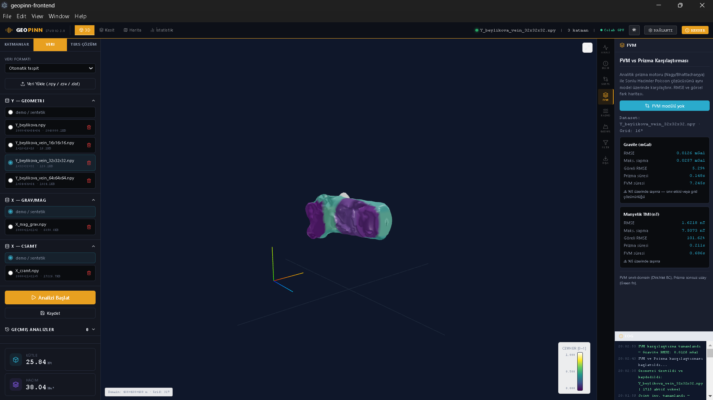
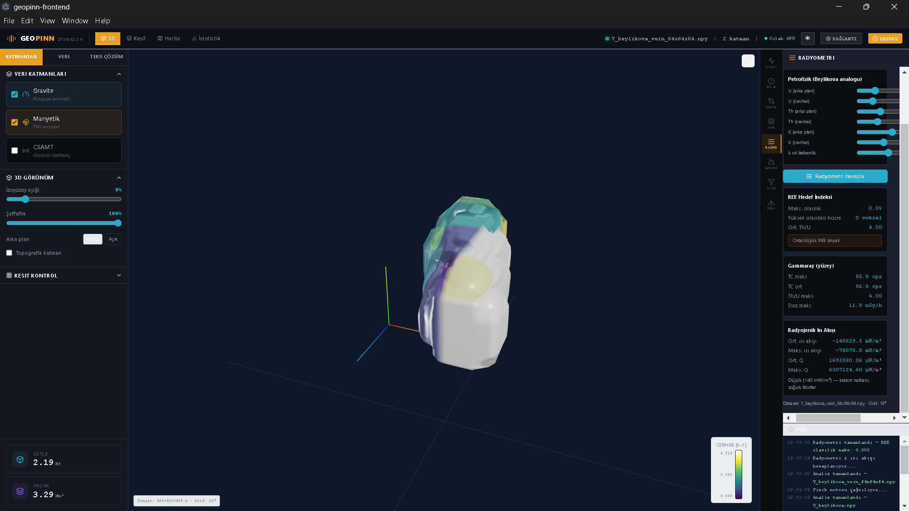
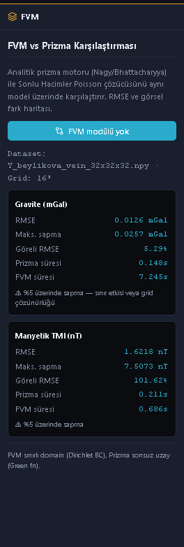
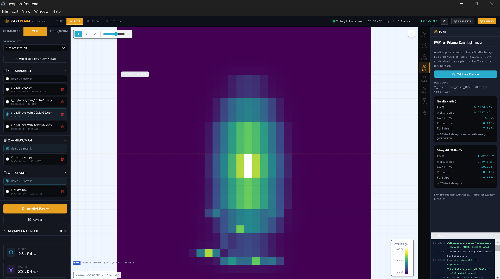
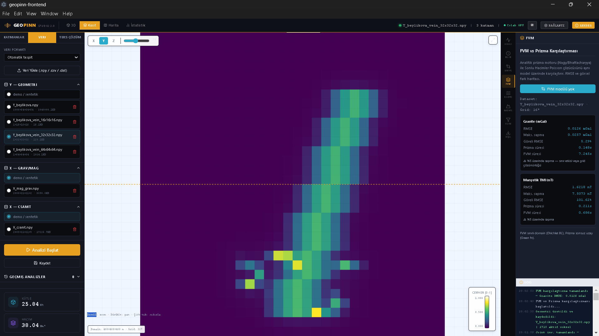
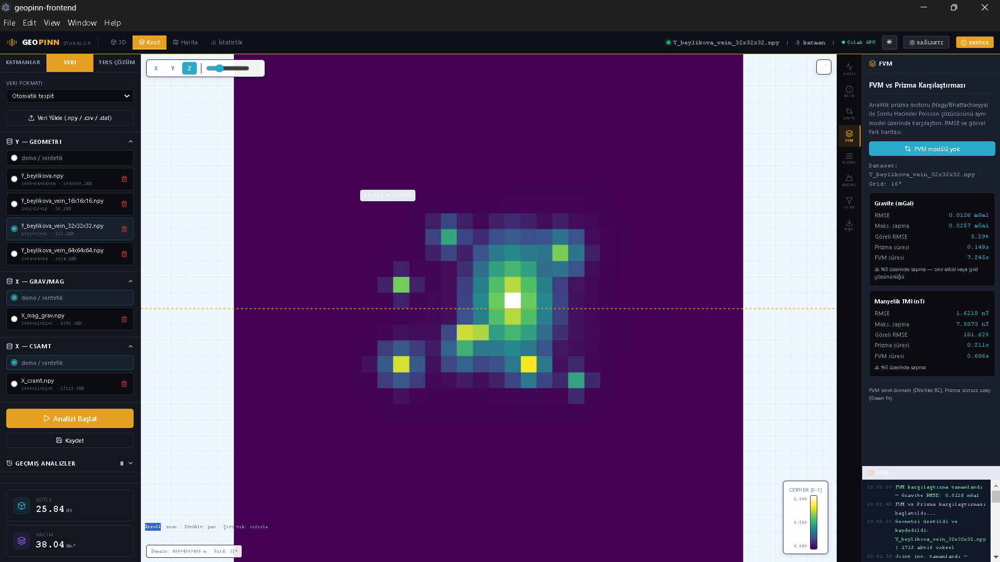
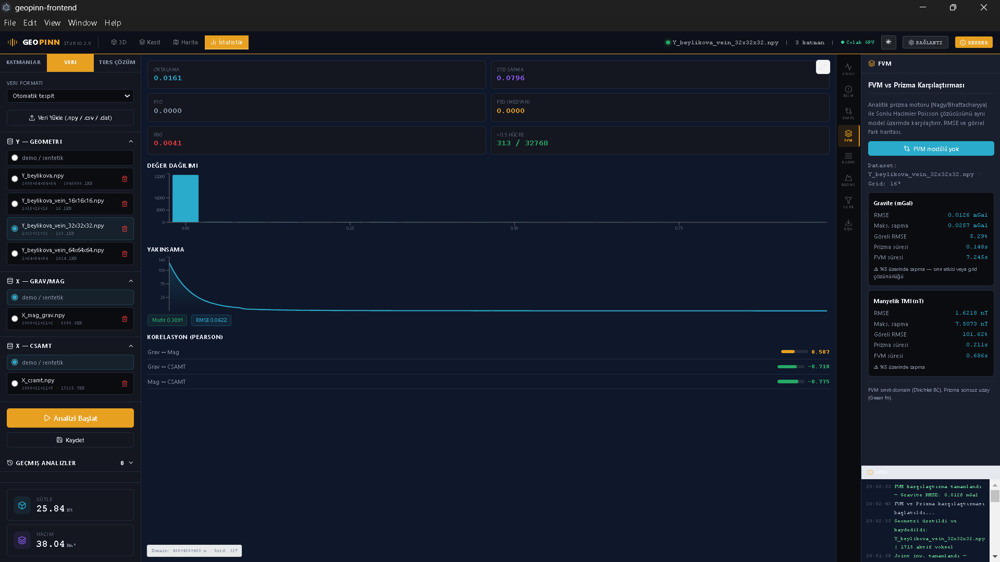
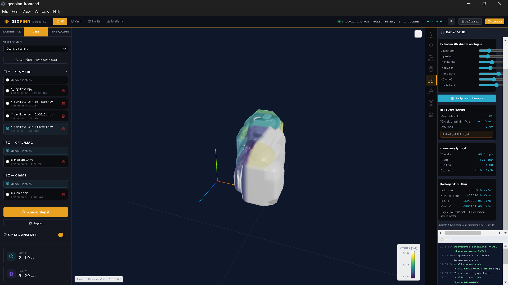

<div align="center">

```
██████╗ ███████╗ ██████╗ ██████╗ ██╗███╗   ██╗███╗   ██╗
██╔════╝ ██╔════╝██╔═══██╗██╔══██╗██║████╗  ██║████╗  ██║
██║  ███╗█████╗  ██║   ██║██████╔╝██║██╔██╗ ██║██╔██╗ ██║
██║   ██║██╔══╝  ██║   ██║██╔═══╝ ██║██║╚██╗██║██║╚██╗██║
╚██████╔╝███████╗╚██████╔╝██║     ██║██║ ╚████║██║ ╚████║
 ╚═════╝ ╚══════╝ ╚═════╝ ╚═╝     ╚═╝╚═╝  ╚═══╝╚═╝  ╚═══╝
```

**STUDIO 3.0** — Applied Geophysics Suite

*Gravity · Magnetics · CSAMT · Radiometry · Heat Flow · FVM*

[](LICENSE)
[](https://python.org)
[](https://pytorch.org)
[](https://simpeg.xyz)
[](https://electronjs.org)

</div>

---

## Overview

GeoPINN Studio is a desktop application for 3D geophysical forward modelling, joint inversion, and mineral exploration analysis. Built for REE-F-Ba-Th deposit exploration (Beylikova analogue), it integrates multiple geophysical methods in a unified GPU-accelerated environment.

**Architecture:** React + Three.js frontend · FastAPI backend · PyTorch GPU engines · Colab/local deployment

---

## v3.0.0.1 — What's New

| Feature | Details |
|---------|---------|
| **Radiometry & Heat Flow** | U/Th/K → gammaray forward model, REE alteration index, FVM heat conduction |
| **FVM Engine** | Poisson bounded domain solver, prism vs FVM comparison |
| **Data Format Selector** | 7 geophysical formats auto-detected (CSV/XYZ/DAT) |
| **Dual Theme** | Full dark `#0A0C0F` ↔ full light, persistent |
| **Vertical Tab Rail** | 8 right-panel tabs in 46px icon rail |
| **System Tray** | Minimize to tray, maximize on launch (Electron) |

---

## Screenshots

### 3D Model — Beylikova Vein Geometry (32³ grid)

*Hydrotermal damar geometrisi — Gravite RMSE: 0.0126 mGal (FVM vs Prizma)*

### Radiometry Panel — U/Th/K & Heat Flow

*Radyometri & radyojenik ısı akışı analizi — Y_beylikova_vein_64x64x64.npy*

### FVM vs Prism Comparison

*Gravite RMSE: 0.0126 mGal · Göreli: 5.29% · Prizma: 0.148s · FVM: 7.245s*

### Cross-Section Views (X / Y / Z)



*32³ grid üç eksen kesit — viridis renk skalası*

### Statistics — Joint Inversion Convergence

*Misfit: 124.54 → 0.389 (150 iter) · Grav↔Mag: 0.507 · Mag↔CSAMT: -0.775*

### Data Panel — Format Selector

*Veri formatı otomatik tespit — Y/X/CSAMT dataset yönetimi*

### Anomaly Export

*Dışa aktarılan Bouguer anomali haritası*

---

## Physics Engines

### Forward Modelling
| Engine | Method | Backend | GPU |
|--------|--------|---------|-----|
| `gravity_prism.py` | Nagy analytic | PyTorch | ✓ |
| `magnetic_prism.py` | Bhattacharyya TMI | PyTorch | ✓ |
| `csamt_1d.py` | Wait recursion MT | PyTorch | ✓ |
| `gravity_fvm.py` | Poisson FVM (∇²U=4πGρ) | scipy.sparse | — |
| `magnetic_fvm.py` | Poisson FVM (∇²φ=∇·M) | scipy.sparse | — |
| `heat_flow_fvm.py` | Heat conduction (∇²T=-Q/k) | scipy.sparse | — |
| `radiometry.py` | U/Th/K → gammaray forward | numpy | — |

### Inversion
| Method | Algorithm | Notes |
|--------|----------|-------|
| Joint Inversion | Adam + autograd | Grav + Mag + CSAMT simultaneous |
| SimPEG Tikhonov | Gauss-Newton + adjoint | L2 regularization, sensitivity matrix |
| Uncertainty (UQ) | Monte Carlo | n_realizations, CV/P10/P50/P90 |

### Petrophyics (Beylikova REE Analogue)
```
ρ(x) = 2.70 + 2.00 × f(x)      [g/cm³]   density
χ(x) = 1e-4 + 3e-4 × f(x)      [SI]      susceptibility  
ρₑ(x) = 500 × 0.10^f(x)        [Ω·m]     resistivity
Q(x)  = ρ·(9.52e-5·U + 2.56e-5·Th + 3.48e-6·K)  [W/m³]  heat production
```

---

## Workflow — Beylikova REE Exploration

```
① Geometry Generator
   └─ Beylikova Vein type · dip=60° · depth=30-400m · width=60m
        ↓
② Forward Modelling  
   └─ Gravity + Magnetics (GPU) · engine: Prism or FVM
        ↓
③ Radiometry & Heat Flow
   └─ U/Th/K → Th/U ratio → REE alteration index → surface heat flux
        ↓
④ Joint Inversion
   └─ Adam optimizer · 150 iter · 16³-64³ grid · Grav+Mag+CSAMT
        ↓
⑤ Uncertainty Analysis  
   └─ 8 realizations · 5% noise · CV map · high-confidence zones
        ↓
⑥ FVM Validation
   └─ Prism vs FVM RMSE · boundary effect check
        ↓
⑦ Export
   └─ CSV (model points) · PNG (anomaly maps)
```

---

## FVM Results (v3.0.0.1)

Benchmark on `Y_beylikova_vein_32x32x32.npy` (32³ grid):

| Method | RMSE | Max Diff | Rel. RMSE | Time |
|--------|------|----------|-----------|------|
| **Gravity** (mGal) | 0.0126 | 0.0257 | 5.29% | Prism: 0.148s · FVM: 7.245s |
| **Magnetics** (nT) | 1.6218 | 7.5073 | 101.62% | Prism: 0.211s · FVM: 0.686s |

> Magnetic FVM divergence (101%) is expected — FVM uses scalar potential approximation (∇²φ=∇·M) vs Bhattacharyya full tensor. Domain boundary effects dominate for thin vein geometries. Gravity FVM at 5.29% is within acceptable range.

---

## Installation

### Prerequisites
```bash
# Backend
pip install fastapi uvicorn numpy scipy torch pyngrok
pip install simpeg discretize          # optional — SimPEG inversion
pip install harmonica verde            # optional — validation

# Frontend
npm install
```

### Run (Development)
```bash
# 1. Start backend (local or Colab)
cd geopinn-backend
uvicorn server:app --host 127.0.0.1 --port 8000

# 2. Start frontend
cd geopinn-frontend
npm run dev
```

### Run on Google Colab (GPU)
```python
# In Colab notebook:
!pip install fastapi uvicorn pyngrok simpeg discretize
from pyngrok import ngrok
ngrok.set_auth_token("YOUR_TOKEN")
# Run Server Başlat cell → copy ngrok URL → paste in app Settings
```

### Build Desktop App (Windows)
```bash
cd geopinn-frontend
npm run dist
# Output: dist-electron/GeoPINN Studio-win.zip
```

---

## API Endpoints

| Endpoint | Method | Description |
|----------|--------|-------------|
| `/api/health` | GET | Server status |
| `/api/run-physics-engine` | POST | Forward modelling (prism/fvm) |
| `/api/joint-inversion` | POST | Adam joint inversion |
| `/api/uncertainty` | POST | Monte Carlo UQ |
| `/api/simpeg/inversion` | POST | SimPEG Tikhonov L2 |
| `/api/fvm/compare` | POST | Prism vs FVM benchmark |
| `/api/radiometry/forward` | POST | U/Th/K → gammaray + heat flow |
| `/api/generate-geometry` | POST | Synthetic geometry generator |
| `/api/analyses` | GET/POST/DELETE | Analysis history |
| `/api/data/list` | GET | Dataset management |

Full API docs: `http://localhost:8000/docs`

---

## Data Formats

| Format Key | Extensions | Columns |
|-----------|-----------|---------|
| `model_npy` | `.npy` | GeoPINN 3D grid |
| `radiometry_csv` | `.csv .xyz .dat` | x, y, U_ppm, Th_ppm, K_pct |
| `sp_csv` | `.csv .dat` | x, y, SP_mV |
| `ip_csv` | `.csv .dat` | x_mid, depth, chargeability_ms, resistivity_ohmm |
| `seismic_refrac_csv` | `.csv .dat` | offset_m, tt_ms |
| `grav_csv` | `.csv .dat` | x, y, gz_mGal |
| `mag_csv` | `.csv .dat` | x, y, TMI_nT |

---

## Roadmap

### v3.1.0
- [ ] `data_fusion.py` — multi-method composite anomaly score (Co-kriging)
- [ ] IP forward engine — Cole-Cole complex resistivity
- [ ] SP forward engine — electrokinetic coupling (∇²V = ∇·(L·∇T))
- [ ] Field data gridding — irregular → regular (RBF interpolation)

### v4.0.0 — PINN Integration
- [ ] Physics-Informed Neural Networks — PDE loss (Laplace/Poisson)
- [ ] PyTorch autograd physics layer (`physics_eqs.py`)
- [ ] Multi-method PINN joint inversion
- [ ] Transfer learning: synthetic → real field data

---

## Citation

```bibtex
@software{geopinn_studio_2026,
  title   = {GeoPINN Studio: Applied Geophysics Desktop Suite},
  version = {3.0.0.1},
  year    = {2026},
  url     = {https://github.com/bilaltlc/geopinn-studio},
  note    = {Beylikova REE-F-Ba-Th exploration analogue}
}
```

---

## License

MIT License — see [LICENSE](LICENSE)

---

<div align="center">
<sub>GeoPINN Studio · Applied Geophysics · geopinnstudio@geopinn.tr</sub>
</div>
